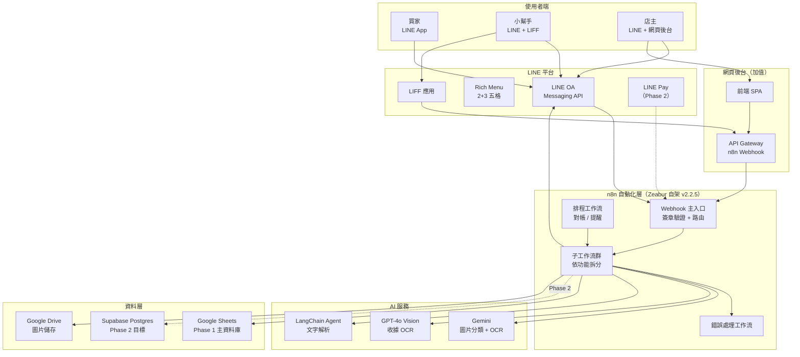
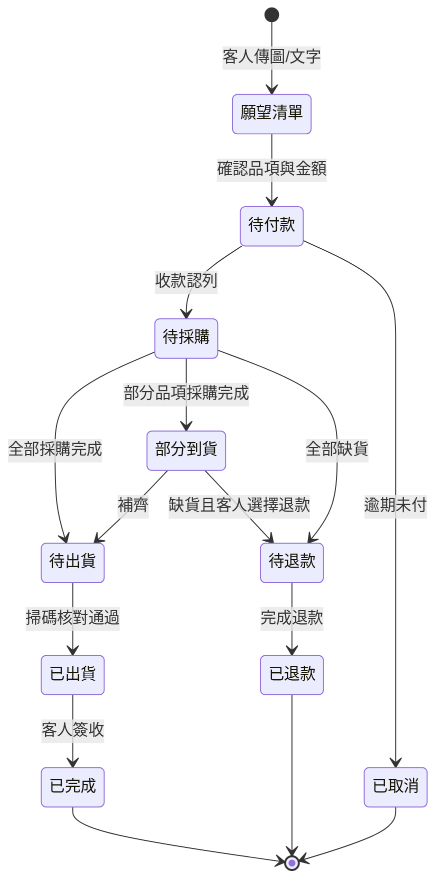
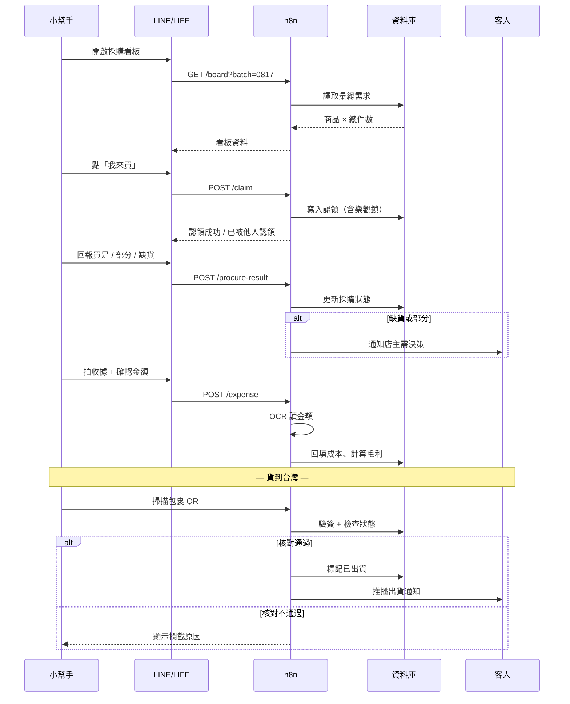
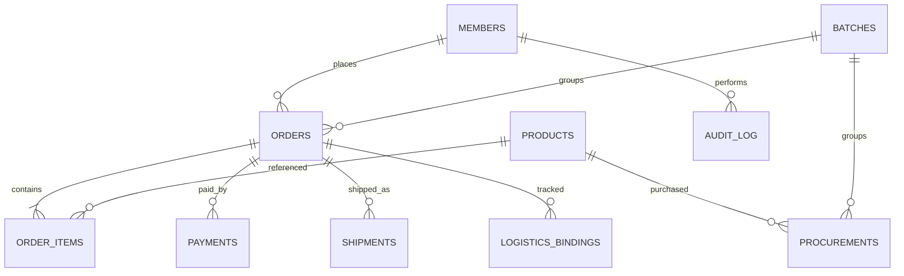
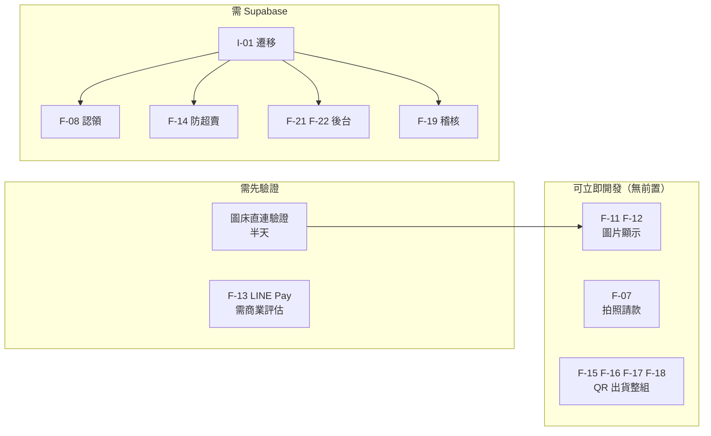

# HEEEHABABY 代購自動化系統｜製作說明書

| 項目 | 內容 |
|---|---|
| 文件版本 | v1.0 |
| 日期 | 2026-08-17 |
| 撰寫 | ZN Studio（Nick Chang） |
| 用途 | 交付給開發代理（AI 或工程師）作為實作依據 |
| 適用範圍 | Phase 1 已交付功能 + 附錄 A 免費升級 + 清單外加值功能 |

---

## 0. 給開發代理的執行指引

**先讀這一節再動工。**

### 0.1 你的角色

你是這個系統的實作者。本文件是唯一的需求來源。文件沒寫的，**一律先問，不要自己補**。

### 0.2 強制規則

1. **不要發明需求。** 規格未定義的行為（錯誤訊息文案、邊界值、預設值），標記為 `[待確認]` 並列在回覆最後，不要自行決定。
2. **不要改變既有節點名稱。** n8n 中任何節點改名，會讓所有下游 `$('舊名稱')` 表達式**靜默失效**，不會報錯。改名後必須全流程搜尋並更新引用。
3. **不要在程式碼或文件中寫死任何金鑰。** 一律使用環境變數。
4. **每個功能完成後，逐項對照該功能的「驗收條件」自我檢查**，並回報結果。
5. 語言：程式註解與變數用英文，使用者可見文字（LINE 訊息、UI 文案）用**繁體中文**。

### 0.3 需要填入的環境變數

本文件所有 `{{...}}` 為佔位符，由系統擁有者於本機填入，**不得寫入版本控制或交付文件**。

```bash
N8N_BASE_URL={{N8N_BASE_URL}}          # 例：https://xxx.zeabur.app
N8N_API_KEY={{N8N_API_KEY}}            # JWT，高權限，切勿外流
GS_SPREADSHEET_ID={{GS_SPREADSHEET_ID}}
GS_CREDENTIAL_ID={{GS_CREDENTIAL_ID}}
LINE_CREDENTIAL_ID={{LINE_CREDENTIAL_ID}}
LINE_CHANNEL_SECRET={{LINE_CHANNEL_SECRET}}
LINE_CHANNEL_ACCESS_TOKEN={{LINE_CHANNEL_ACCESS_TOKEN}}
LINE_OA_ID={{LINE_OA_ID}}
OWNER_LINE_USER_ID={{OWNER_LINE_USER_ID}}   # 店主（周方）的 LINE userId
OPENAI_CREDENTIAL_ID={{OPENAI_CREDENTIAL_ID}}
GEMINI_API_KEY={{GEMINI_API_KEY}}
DRIVE_CREDENTIAL_ID={{DRIVE_CREDENTIAL_ID}}
ERROR_WORKFLOW_ID={{ERROR_WORKFLOW_ID}}
QR_SIGNING_KEY={{QR_SIGNING_KEY}}      # HMAC 金鑰，僅存在於伺服器端
SUPABASE_URL={{SUPABASE_URL}}          # Phase 2
SUPABASE_SERVICE_KEY={{SUPABASE_SERVICE_KEY}}
FX_JPY_TWD={{FX_JPY_TWD}}              # 預設匯率，例 0.215
```

---

## 1. 系統概觀

### 1.1 這是什麼

一套以 **LINE 官方帳號（LINE OA）** 為主要介面的**代購（proxy purchasing）營運自動化系統**。

服務三種角色：

| 角色 | 說明 | 主要介面 |
|---|---|---|
| **買家（客人）** | 向店主下代購訂單的消費者 | LINE OA 對話 + Rich Menu |
| **小幫手** | 在海外現場採購、回台後理貨包貨的人員 | LINE OA + LIFF 網頁 |
| **店主** | 業主本人，掌管定價、收款、決策 | LINE OA + 網頁後台 |

### 1.2 核心業務流程

```
客人丟商品圖/文字到 LINE
    ↓ AI 解析成結構化願望清單
建立訂單（待付款）
    ↓ 客人匯款 → 系統對帳
訂單轉為待採購
    ↓ 所有訂單彙總成採購清單
小幫手海外現場採購（認領 / 回報數量 / 拍收據請款）
    ↓ 成本回填 → 即時毛利
貨到台灣，理貨包貨
    ↓ 掃 QR 核對 → 確認出貨
自動更新狀態 + LINE 通知客人
```

### 1.3 名詞定義

| 名詞 | 定義 |
|---|---|
| **團（batch）** | 一次採購行程，例「0817 日本團」。訂單皆歸屬於某一團 |
| **願望清單（wishlist）** | 客人傳入、尚未成立訂單的商品意向 |
| **拆單（split）** | 一張訂單依到貨批次或運費拆成多張子單 |
| **認領（claim）** | 小幫手宣告「這項我來買」，避免多人重複採購 |
| **回填（backfill）** | 將實際採購成本寫回商品資料，用以計算毛利 |
| **核對（verify）** | 出貨前掃描 QR，比對訂單狀態與付款狀態 |

---

## 2. 系統架構

### 2.1 整體架構圖



### 2.2 分層職責

| 層 | 職責 | 不該做的事 |
|---|---|---|
| LINE OA | 使用者互動、訊息呈現 | 不存業務狀態 |
| LIFF / 前端 | 複雜互動、即時畫面 | **不直連資料庫、不持有金鑰** |
| n8n | 所有業務邏輯、資料讀寫、外部 API 呼叫 | 不做前端渲染 |
| Google Sheets / Supabase | 資料儲存 | 不放業務邏輯 |

### 2.3 訂單狀態機



**狀態轉換規則**

1. 狀態只能依上圖箭頭方向轉換，**不得跳躍**。
2. 每次轉換必須寫入 `order_status_log`（誰、何時、從什麼狀態到什麼狀態、原因）。
3. `待出貨 → 已出貨` 是唯一會觸發客人通知的轉換。
4. 任何往回的狀態修正，必須由店主權限執行並記錄原因。

### 2.4 採購到出貨時序



---

## 3. 資料模型

### 3.1 Phase 1：Google Sheets

一個試算表（`{{GS_SPREADSHEET_ID}}`），下列工作表：

#### `members` 會員
| 欄位 | 型別 | 說明 |
|---|---|---|
| line_user_id | text | LINE userId，主鍵 |
| nickname | text | 綁定暱稱，訂單以此顯示 |
| display_name | text | LINE 顯示名稱 |
| phone | text | 選填 |
| bound_at | datetime | 綁定時間 |
| role | enum | `buyer` / `helper` / `owner` |

#### `products` 商品
| 欄位 | 型別 | 說明 |
|---|---|---|
| sku | text | 主鍵，例 `P01` |
| name_zh | text | 中文品名 |
| name_local | text | 當地語言品名（用於收據比對參考） |
| brand | text | |
| price_twd | number | 售價（給客人） |
| est_cost_jpy | number | 預估進價 |
| actual_cost_jpy | number | 實際進價，由請款回填 |
| image_url | text | 商品圖 |
| batch | text | 所屬團 |

#### `orders` 訂單主檔
| 欄位 | 型別 | 說明 |
|---|---|---|
| order_id | text | 主鍵，格式 `HB{YYMM}-{序號}` |
| line_user_id | text | 外鍵 → members |
| batch | text | 團代號 |
| status | enum | 見 2.3 狀態機 |
| total_twd | number | 訂單總額 |
| paid | boolean | |
| paid_at | datetime | |
| parent_order_id | text | 拆單時指向母單 |
| created_at | datetime | |
| note | text | |

#### `order_items` 訂單明細
| 欄位 | 型別 | 說明 |
|---|---|---|
| item_id | text | 主鍵 |
| order_id | text | 外鍵 |
| sku | text | 外鍵 |
| qty | number | |
| unit_price_twd | number | 下單當下售價（快照，不隨商品改價變動） |
| source_image_url | text | 客人原始圖片 |

#### `procurements` 採購紀錄
| 欄位 | 型別 | 說明 |
|---|---|---|
| proc_id | text | 主鍵 |
| batch | text | |
| sku | text | |
| need_qty | number | 需求總件數 |
| claimed_by | text | 認領人 line_user_id |
| claimed_at | datetime | |
| got_qty | number | 實際買到 |
| state | enum | `open`/`claimed`/`got`/`partial`/`out_of_stock` |
| unit_cost_jpy | number | |
| fx_rate | number | **當下匯率快照** |
| receipt_url | text | 收據照片 |
| amount_edited | boolean | 是否人工修正過 OCR 金額 |
| updated_at | datetime | |

#### `payments` 收款
| 欄位 | 型別 | 說明 |
|---|---|---|
| payment_id | text | 主鍵 |
| order_id | text | |
| amount_twd | number | |
| method | enum | `transfer` / `linepay` / `cash` |
| last5 | text | 匯款帳號後五碼 |
| received_at | datetime | |
| reconciled_by | text | 認列人 |

#### `shipments` 出貨
| 欄位 | 型別 | 說明 |
|---|---|---|
| shipment_id | text | |
| order_id | text | |
| shipped_at | datetime | |
| verified_by_scan | boolean | **是否經掃碼核對** |
| operator | text | 操作人 |
| override_reason | text | 若繞過攔截，記錄原因 |

#### `logistics_bindings` 進貨綁定
| 欄位 | 型別 | 說明 |
|---|---|---|
| tracking_no | text | 物流商單號，主鍵 |
| order_id | text | |
| carrier | text | |
| bound_at | datetime | |
| bound_by | text | |

#### `audit_log` 稽核
| 欄位 | 型別 | 說明 |
|---|---|---|
| log_id | text | |
| ts | datetime | |
| actor | text | |
| action | text | |
| target | text | |
| detail | json | |
| result | enum | `ok`/`warn`/`blocked` |

#### `settings` 系統設定
| key | value | 說明 |
|---|---|---|
| fx_jpy_twd | 0.215 | 目前匯率 |
| current_batch | 0817 | 目前團 |
| push_quota_remaining | number | 推播剩餘額度快取 |

### 3.2 Phase 2：Supabase Postgres



**遷移必須遵守**

1. 欄位名稱與型別沿用 3.1 定義，只把 text 型別的日期改為 `timestamptz`、金額改為 `numeric(12,2)`。
2. 所有表啟用 **Row Level Security**，依 `role` 限制存取。**小幫手不得讀取 `price_twd` 與毛利欄位。**
3. `procurements.claimed_by` 的寫入必須使用**條件更新**（`UPDATE ... WHERE claimed_by IS NULL`），避免併發覆蓋。
4. 遷移期間採**雙寫**：先寫 Supabase、成功後再寫 Sheets，觀察兩週後才停寫 Sheets。

---

## 4. 功能規格

每項功能格式一致：**編號｜名稱｜歸屬｜前置條件｜輸入｜處理｜輸出｜例外｜驗收條件**

歸屬標記：
- `CORE` = Phase 1 已交付
- `APPX-A` = 附錄 A 免費升級清單
- `PAID` = 清單外加值功能
- `INFRA` = 基礎建設

---

### F-01 暱稱綁定 `CORE`

**前置**：使用者已加入 LINE OA 好友。

**輸入**：使用者於 LINE 輸入暱稱（文字），或點 Rich Menu「綁定」。

**處理**
1. 取得 `line_user_id`。
2. 檢查 `members` 是否已存在該 id。
3. 檢查暱稱是否與他人重複（不分大小寫、去除前後空白）。
4. 寫入或更新 `members`。

**輸出**：LINE reply「綁定成功，之後訂單會顯示為【暱稱】」。

**例外**
- 暱稱重複 → 要求重新輸入，提示已被使用。
- 暱稱長度 > 20 字或含表情符號以外的控制字元 → 拒絕。
- 已綁定者再次綁定 → 詢問是否更改，需二次確認。

**驗收**：同一 userId 重複綁定不產生第二筆資料；重複暱稱被擋下。

---

### F-02 廣播群發 `CORE`

**前置**：操作者 role = `owner`。

**輸入**：訊息內容、受眾分群（全部 / 本團有下單 / 未付款）。

**處理**
1. 依分群查詢目標 `line_user_id` 清單。
2. **發送前回傳預計人數，等待二次確認。**
3. 呼叫 LINE Multicast API，每批上限 500 人。
4. **檢查 API 回應**，記錄成功／失敗筆數。

**輸出**：發送結果摘要（成功 N 人 / 失敗 M 人）。

**例外**
- 推播額度不足 → **不發送**，回報剩餘額度。
- 部分失敗 → 列出失敗 userId，可重送。

**關鍵注意**
> LINE **推播（push/multicast）訊息消耗每月額度，回覆（reply）訊息不消耗。**
> 額度用罄時，n8n 執行紀錄仍顯示成功——**必須明確檢查 LINE API 的 HTTP 回應碼與 body**，否則會誤判。

**驗收**：額度不足時確實阻擋；發送人數與預告人數一致。

---

### F-03 訂單查詢 `CORE`

**輸入**：客人點 Rich Menu「查訂單」或輸入關鍵字。

**處理**
1. 以 `line_user_id` 查 `orders`。
2. 取最近 N 筆（預設 5），依建立時間倒序。
3. 組成 Flex Message Carousel。

**輸出**：每張卡顯示訂單編號、狀態、金額、品項摘要；`APPX-A` 追加原始圖片（見 F-11）。

**例外**：無訂單 → 友善提示與下單引導。

**驗收**：只能查到本人訂單，不可查到他人。

---

### F-04 訂單拆分 `CORE`

**前置**：操作者 role = `owner`。訂單狀態為 `待採購` 或 `部分到貨`。

**輸入**：母訂單編號 + 要拆出的品項與數量。

**處理**
1. 建立子單 `{母單號}-A`、`-B`…，`parent_order_id` 指向母單。
2. 移轉指定 `order_items`，重算各單金額。
3. 母單若已無品項則標記為已拆分完畢。
4. 寫入 `audit_log`。

**輸出**：拆分結果摘要，可選擇是否通知客人。

**例外**
- 已出貨訂單不可拆。
- 拆分後金額總和必須等於母單原金額，**不符則整筆回滾**。

**驗收**：拆分前後總金額一致；付款狀態正確繼承。

---

### F-05 AI 願望清單解析 `CORE`

**輸入**：客人傳入文字訊息或圖片。

**處理**

*文字路徑*
1. 送入 LangChain Agent（模型：Gemini 2.5-flash-lite）。
2. 要求輸出**純 JSON**，格式：
```json
{ "items": [ { "name": "", "qty": 1, "note": "" } ], "confidence": 0.0 }
```
3. 解析失敗或 `confidence < 0.6` → 轉人工確認流程。

*圖片路徑*
1. Gemini 先分類：`product_photo` / `screenshot_with_text` / `receipt` / `other`。
2. 依分類選擇 OCR 策略（含文字者送 GPT-4o Vision）。
3. 抽取商品名與數量，同上輸出 JSON。
4. 圖片存入 Google Drive，回傳可存取 URL 寫入 `order_items.source_image_url`。

**輸出**：Flex 確認卡，列出解析結果，客人可修改數量或刪除品項後確認。

**例外**
- 完全無法解析 → 回覆「看不太懂，可以直接打商品名稱嗎？」
- 多商品圖片 → 逐項列出，允許逐項勾選。

**強制規則**
> **AI 解析結果一律需客人確認後才成立訂單。** 不得自動成單。

**驗收**：JSON 解析失敗不造成流程中斷；圖片 URL 可正常存取。

---

### F-06 付款對帳 `CORE`

**輸入**：銀行入帳資料（金額、時間、帳號後五碼）；或店主手動輸入。

**處理**
1. 以金額比對 `orders` 中 `paid = false` 的訂單。
2. 唯一符合 → 提示可一鍵認列。
3. 多筆符合 → 列出候選，由店主指定。
4. 認列後寫入 `payments`，訂單 `paid = true`，狀態 `待付款 → 待採購`。
5. 推播收款確認給客人。

**例外**
- 金額不符任何訂單 → 標記待處理，不自動配對。
- 溢繳／短繳 → 記錄差額，不自動認列。

**驗收**：不會把同一筆入帳認列到兩張訂單。

---

### F-07 小幫手拍照請款 `APPX-A`（A1 + A2 + A3）

**前置**：操作者 role = `helper`（**必須驗證身分，非小幫手不得寫入成本**）。

**流程設計原則（重要）**
> 日本收據印的是當地語言品名，與系統中文品名無法可靠比對。
> **必須先選商品、再上傳收據**，讓 OCR 只負責讀「金額」單一數值。
> 不得讓 AI 自行判斷收據對應哪個商品。

**輸入**
1. 小幫手選擇商品（從本團未請款清單）。
2. 上傳收據照片。
3. 確認或修正金額。

**處理**
1. 顯示本團 `state != 'got'` 的商品清單（Flex Carousel 或 LIFF 列表）。
2. 收到照片 → 存 Drive → 送 OCR（GPT-4o Vision），prompt 限縮為「只回傳金額數字，不要其他文字」。
3. 回傳辨識金額，**必須等待人工確認**。
4. 確認後寫入 `procurements`：`unit_cost_jpy`、`fx_rate`（**當下匯率快照**）、`receipt_url`、`amount_edited`。
5. 計算並回覆：台幣成本 = `unit_cost_jpy × fx_rate`；毛利率 = `(price_twd − 台幣成本) / price_twd`。

**輸出**：LINE 訊息顯示商品、實付日幣、台幣成本、售價、毛利率。毛利率 < 20% 時附加提醒。

**例外**
- OCR 無法讀出數字 → 請小幫手直接手動輸入。
- 輸入金額 ≤ 0 或非數字 → 拒絕並重問。
- 同一商品在不同店買到不同價 → **允許多筆 procurement 記錄，成本以加權平均計算**。

**待確認事項**
- `[待確認]` 收據金額是含稅或未稅？免稅店有兩種價，需統一基準。

**驗收**
1. 非 helper 身分無法寫入成本。
2. 匯率變動後，既有紀錄的台幣成本不改變（因已快照）。
3. 人工修正過的金額在資料中可辨識。

---

### F-08 現場採購看板 `APPX-A`（A4）

**前置**：role = `helper` 或 `owner`。

**介面**：LIFF 網頁（**不可用純 Flex Message**，因需即時反映他人認領狀態）。

**輸入**：批次代號。

**處理**
1. 彙總本團所有 `待採購` 訂單的 `order_items`，依 sku 加總件數。
2. 排序：未認領優先，其次件數多者優先。
3. 顯示每項的需求件數與下單客人摘要。

**認領機制（核心）**
1. 小幫手點「我來買」→ 送出認領請求。
2. 伺服器端以**條件更新**寫入：僅在 `claimed_by IS NULL` 時成功。
3. 已被他人認領者，該項在其他人畫面顯示為鎖定、按鈕消失。
4. 認領者可「放掉」，恢復未認領。

**採購結果回報（三種）**
| 結果 | 資料變更 | 後續動作 |
|---|---|---|
| 買足 | `got_qty = need_qty`, `state='got'` | 進入請款流程 |
| 只買到 N 件 | `got_qty = N`, `state='partial'` | **立即通知店主決策** |
| 買不到 | `got_qty = 0`, `state='out_of_stock'` | **立即通知店主決策** |

**例外**
- 併發認領 → 後到者收到「已被 X 認領」，不得覆蓋。
- 回報數量 ≥ 需求數量時應選「買足」，不得填入 partial。

**架構限制（必讀）**
> Google Sheets 為 last-write-wins，**無法可靠支援併發認領**。
> 若需認領機制，`procurements` 表**必須先遷移至 Supabase**（見 I-01）。
> 若確認現場僅單人採購，可省略認領機制，此時 Sheets 可行。

**驗收**
1. 兩個瀏覽器同時點同一項的「我來買」，只有一個成功。
2. 缺貨與部分買到，店主在 30 秒內收到通知。

---

### F-09 看圖理貨 `APPX-A`（B6）

**輸入**：待出貨訂單清單。

**處理**
1. 列出 `待出貨` 訂單，每張卡顯示客人原始圖片（`order_items.source_image_url`）、品項與數量。
2. 包貨人員對照圖片撿貨。

**輸出**：可視化理貨清單。

**範圍待釐清**
> `[待確認]` 合約原文寫「後台理貨」，未定義「後台」是指 Google Sheets 資料端或網頁介面。
> **實作前必須確認**，否則影響此功能歸屬 `APPX-A` 或 `PAID`。

**驗收**：每張訂單卡顯示的圖片與品項一致，無錯位。

---

### F-10 確認出貨與通知 `APPX-A`（B5）

**輸入**：訂單編號 + 操作者身分。

**處理**
1. 檢查訂單狀態為 `待出貨`。
2. 更新為 `已出貨`，寫入 `shipments`（含 `verified_by_scan` 標記）。
3. 推播通知客人。

**通知內容範本**
```
📦 出貨通知

{暱稱} 您好，您的訂單 {order_id} 已出貨囉！

品項：{品項摘要}
預計 {N} 個工作天內送達

有任何問題歡迎直接回覆這則訊息 🙌
```

**例外**
- 訂單未付款 → 預設阻擋，需店主權限覆寫並記錄原因。
- 已出貨訂單重複操作 → 拒絕。

**驗收**：出貨後客人確實收到通知；重複出貨被擋下。

---

### F-11 訂單圖片顯示 `APPX-A`（D1）

**處理**
1. 在 F-03 查單 Flex 卡加入 hero image 區塊。
2. 圖片來源為 `order_items.source_image_url`。

**前置技術驗證（必做）**
> 先驗證 Google Drive 直連格式 `https://lh3.googleusercontent.com/d/{FILE_ID}=w200` 能否在 LINE Flex Message 中正常渲染。
> **若無法渲染，改用 Cloudinary 作為圖床。**
> 此驗證約需半天，須在動工前完成。

**例外**：圖片不存在或載入失敗 → 顯示預設佔位圖，不可讓整張 Flex 卡失敗。

**驗收**：iOS 與 Android 的 LINE 皆能正常顯示。

---

### F-12 商品型錄圖片 `APPX-A`（D2）

**處理**：商品列表 Flex Carousel 加入商品圖，來源 `products.image_url`。

**技術限制**：LINE Flex Carousel 單則上限 12 個 bubble；超過需分頁。

**驗收**：12 項以上商品能正確分頁。

---

### F-13 LINE Pay 一鍵結帳 `APPX-A`（E1）

**流程**
1. 客人於訂單確認頁點「LINE Pay 付款」。
2. n8n 呼叫 LINE Pay Request API 建立交易，取得 `paymentUrl`。
3. 導向客人完成付款。
4. LINE Pay 回呼 → n8n 呼叫 Confirm API。
5. 確認成功後寫入 `payments`，訂單狀態更新。

**例外**
- Confirm 失敗 → 訂單不得標記已付款，需人工介入。
- **必須實作冪等處理**：同一 `transactionId` 重複回呼只認列一次。

**商業前置（必須先評估，非技術問題）**
> LINE Pay 撥款為 **T+7**。代購業需先付上游供應商，此延遲等同商家墊付七天現金。
> **費率與撥款週期對毛利的影響須由業主評估並書面確認後，才可開始開發。**

**驗收**：重複回呼不重複認列；付款失敗訂單狀態不變。

---

### F-14 硬性防超賣 `APPX-A`（F1）

**前置**：**必須先完成 Supabase 遷移**（I-01）。

**處理**
1. 商品設定 `stock_limit`（限量數）。
2. 下單時於資料庫層以**交易 + 條件更新**扣減：
```sql
UPDATE products
SET reserved = reserved + :qty
WHERE sku = :sku AND reserved + :qty <= stock_limit
RETURNING *;
```
3. 回傳 0 筆即為超賣，拒絕下單。

**例外**：訂單取消或退款時須釋回 `reserved`。

**架構限制**
> Google Sheets **無法實作硬性防超賣**。並發寫入會互相覆蓋，限量必然失效。
> 此功能與 Supabase 遷移**不可分割**。

**驗收**：模擬 20 個並發請求搶 5 個名額，最終成立訂單恰為 5 筆。

---

### F-15 QR 出貨標籤產生器 `PAID`

**輸入**：一或多筆待出貨訂單。

**QR 內容格式**
```
HB|{order_id}|{signature}
```
- 分隔符 `|`
- `signature` 為 4 碼英數（見 F-16）
- **全部為 ASCII 字元**，避免部分掃描器對非 ASCII 輸出亂碼

**標籤規格**
| 項目 | 規格 |
|---|---|
| 紙張 | 50 × 30 mm 熱感標籤 |
| QR 尺寸 | ≥ 18 mm 見方 |
| 容錯等級 | Q（約 25% 可復原） |
| 靜區 | ≥ 4 模組寬 |
| 文字區 | 訂單編號、客人暱稱、件數、日期、店名 |

**處理**：批次產生 → 產出可列印頁面（CSS `@page { size: 50mm 30mm; margin: 0 }`）。

**驗收**：印出後以實體掃描器可讀；標籤對折或輕微污損仍可讀。

---

### F-16 HMAC 防偽簽章 `PAID`

**演算法**
```
signature = UPPER( BASE36( HMAC-SHA256( QR_SIGNING_KEY, order_id )[0..3] ) )[0..3]
```
取雜湊結果前若干位元轉 base36，截為 4 碼。

**強制規則**
> 1. `QR_SIGNING_KEY` **只能存在於伺服器端環境變數**。
> 2. 簽章的產生與驗證**只能在 n8n 執行**，前端不得持有金鑰或實作演算法。
> 3. 前端只負責把掃到的字串送給後端驗證。

**強度說明**：4 碼 base36 約 168 萬組合。足以防止人工偽造標籤，不足以抵抗自動化暴力嘗試。如需提升改為 6 碼，QR 尺寸幾乎不變。

**驗收**：竄改 `order_id` 或 `signature` 任一字元，驗證必定失敗。

---

### F-17 掃碼核對工作站 `PAID`

**硬體假設**：藍牙／USB 二維條碼掃描器，運作於**鍵盤模擬（keyboard wedge）模式**——掃描結果以鍵盤輸入方式送出，末端附 Enter。

**介面要求**
1. 頁面有一個**永遠保持焦點**的輸入框，失焦後自動取回。
2. 收到 Enter 即觸發核對，並清空輸入框準備下一次掃描。
3. 核對結果以**大面積顏色區塊**呈現（綠／黃／紅），倉庫環境需一眼可辨。

**選型注意**：需選用支援純 ASCII 輸出或可設定為資料模式的機型。部分低價機型遇非 ASCII 會輸出亂碼。

**驗收**：連續掃描 20 件不需滑鼠操作；掃描間隔 < 1 秒不漏讀。

---

### F-18 例外攔截 `PAID`

掃碼核對必須依序檢查，**任一不通過即停止並顯示原因**：

| 順序 | 檢查 | 結果 | 訊息 |
|---|---|---|---|
| 1 | 格式為 `HB\|x\|y` | 紅 | 格式不是本店標籤 |
| 2 | order_id 存在 | 紅 | 查無此訂單 |
| 3 | 簽章驗證通過 | 紅 | 驗證碼不符，這張標籤不是系統印的 |
| 4 | 尚未出貨 | 黃 | 這張單已經出過貨了 |
| 5 | 已付款 | 黃 | 這位客人還沒付款 |
| 6 | 所有品項已採購 | 黃 | 這張單還有品項沒買到 |
| — | 全部通過 | 綠 | 核對通過，可以出貨 |

**黃燈**允許有權限者覆寫，但**必須填寫原因並寫入 `audit_log`**。
**紅燈**不得覆寫。

**驗收**：六種情境逐一測試，行為與上表一致。

---

### F-19 出貨稽核軌跡 `PAID`

**處理**：所有出貨動作寫入 `audit_log` 與 `shipments`，記錄：
- 操作者、時間、訂單
- `verified_by_scan`：是否經掃碼（**未經掃碼的手動出貨必須標記**）
- 若為覆寫，記錄攔截原因與覆寫理由

**輸出**：可依日期、操作者、結果篩選的查詢介面。

**驗收**：以看圖模式手動出貨者，紀錄可明確識別為未經核對。

---

### F-20 進貨物流綁定 `PAID`

**與出貨的根本差異**
> 出貨端 QR 由本系統列印，訂單資料寫在碼內，**不需對照表**。
> 進貨端條碼由物流商產生，內容不可控，**必須建立對照表**。

**處理**
1. 掃描或輸入物流單號。
2. 選擇對應訂單。
3. 寫入 `logistics_bindings`。

**例外**
- 單號已綁定 → 拒絕，顯示既有綁定。
- 一張訂單多個包裹 → 允許一對多。

**驗收**：重複綁定被擋下；可反查某訂單的所有包裹。

---

### F-21 後台框架與權限 `PAID`

**前置**：Supabase 遷移完成（I-01）。

**技術選型建議**：SPA（React 或同等），透過 API Gateway（I-02）存取資料，**不得直連資料庫**。

**角色與權限**

| 功能 | 店主 | 助手 | 理貨 |
|---|---|---|---|
| 查看訂單 | ✓ | ✓ | ✓ |
| 查看售價 | ✓ | ✓ | ✗ |
| **查看成本與毛利** | ✓ | ✗ | ✗ |
| 修改訂單 | ✓ | ✓ | ✗ |
| 認列收款 | ✓ | ✗ | ✗ |
| 出貨操作 | ✓ | ✓ | ✓ |
| 覆寫攔截 | ✓ | ✗ | ✗ |
| 群發訊息 | ✓ | ✗ | ✗ |
| 系統設定 | **維運方** | ✗ | ✗ |

**強制規則**
> 權限必須在**伺服器端**強制執行（Supabase RLS + API 層雙重檢查）。
> 僅在前端隱藏選單**不算實作權限**。

**驗收**：以助手帳號直接呼叫成本相關 API，必須回傳 403。

---

### F-22 營運儀表板 `PAID`

**顯示內容**
- 本團營收、已登錄成本、已知毛利、毛利率
- 待採購件數、待出貨筆數、未收款金額
- 今日待辦（依急迫度排序，可跳轉對應頁面）
- 毛利最高品項排行

**毛利呈現規則（重要）**
> 未登錄成本的品項**不得計入毛利分母**，並須明確標示「尚未登錄成本 NT$X」。
> 不可用預估成本充當實際成本計算毛利，會造成決策誤判。

**驗收**：登錄一筆成本後，所有數字同步更新且加總正確。

---

### F-23 匯率管理 `PAID`

**處理**
1. `settings.fx_jpy_twd` 為目前匯率，僅店主可改。
2. 每筆 `procurements` 寫入時**快照當下匯率**。
3. 匯率變更寫入歷史紀錄。

**理由**：同一團前後匯率不同時，若無快照，回頭重算會得到與當初不同的毛利，帳目無法核對。

**驗收**：修改匯率後，既有紀錄的台幣成本不變，新紀錄使用新匯率。

---

### I-01 Supabase 遷移 `INFRA`

**觸發原因**：下列功能無法在 Google Sheets 上可靠實作。

| 功能 | 原因 |
|---|---|
| F-08 認領機制 | 併發寫入衝突 |
| F-14 防超賣 | 需資料庫層交易 |
| F-21 後台 | Sheets API 讀取配額不足 |
| F-19 稽核 | 資料量成長 |

**配額限制**：Google Sheets API 讀取約每分鐘 60 次／使用者。單一後台頁面載入即可能消耗十餘次。

**遷移步驟**
1. 建立 schema（依 3.2）
2. 啟用 RLS 與角色政策
3. 歷史資料匯入與比對
4. 雙寫期（建議兩週）
5. 切換讀取來源
6. 停止寫入 Sheets，保留唯讀備份

**歸屬待確認**
> `[待確認]` 現行協議載明「Supabase 帳號所有權於驗收後移轉予業主」。
> 此條款影響後續維運責任歸屬，**須於開發前確認最終版本**。

---

### I-02 API Gateway `INFRA`

所有前端請求統一經 n8n Webhook。

**規範**
1. 路徑格式：`/api/v1/{resource}/{action}`
2. 認證：LIFF ID Token 或後台 JWT，**於 n8n 端驗證**
3. 回應格式統一：
```json
{ "ok": true, "data": {}, "error": null }
{ "ok": false, "data": null, "error": { "code": "", "message": "" } }
```
4. 所有寫入操作需冪等鍵（`Idempotency-Key` header）

---

### I-03 錯誤處理 `INFRA`

1. 所有工作流指定共用 Error Workflow（`{{ERROR_WORKFLOW_ID}}`）。
2. 錯誤發生時推播通知維運方，內容含工作流名稱、節點、輸入摘要。
3. **對使用者的錯誤訊息不得暴露技術細節**，統一為「系統忙碌中，稍後再試」。

---

### I-04 備份 `INFRA`

1. 每日自動匯出資料庫快照，保留 30 天。
2. 工作流 JSON 定期匯出版本控制。
3. **備份還原程序須實際演練並記錄耗時。**

---

## 5. n8n 實作規範

### 5.1 已知陷阱（違反會產生難以察覺的錯誤）

| # | 陷阱 | 對策 |
|---|---|---|
| 1 | 節點改名後，下游 `$('舊名稱')` **靜默失效**，不報錯 | 改名後全流程搜尋並更新引用 |
| 2 | Postback Switch 規則數必須**完全等於** `connections.main` 陣列長度 | 不符時未匹配分支靜默終止 |
| 3 | Google Sheets 更新節點會寫入 `columns.value` 中**所有欄位**，含空值 | 每個欄位用獨立更新節點，避免覆蓋無關欄位 |
| 4 | Google Sheets `filtersUI` **只回傳第一筆符合的列** | 需多列時省略 filtersUI，改在下游 Code 節點過濾 |
| 5 | LINE push 消耗額度、reply 不消耗；額度用罄仍顯示成功 | 明確檢查 LINE API 回應 |
| 6 | `PUT /api/v1/workflows/{id}` 僅接受 `name`、`nodes`、`connections`、`settings`、`staticData` | 送出前移除其他 settings 鍵，否則 400 |
| 7 | 使用過期的 workflow 變數執行 PUT 會遺失規則 | 每次 PUT 前**重新取得**最新 workflow |

### 5.2 工作流拆分原則

- 一個工作流負責一件事，主流程僅做路由。
- 子工作流以 Execute Workflow 呼叫，介面（輸入輸出）明確定義。
- 命名規則：`{領域}-{動作}-v{版本}`，例 `order-split-v1`。

### 5.3 API 操作

```bash
export N8N_API_KEY='{{N8N_API_KEY}}'
export N8N_BASE='{{N8N_BASE_URL}}/api/v1'

# 連線檢查
curl -s -H "X-N8N-API-KEY: $N8N_API_KEY" "$N8N_BASE/workflows?limit=1"
```

大型 payload 使用 `--data-binary @file.json --max-time 60`。

---

## 6. 非功能需求

| 項目 | 要求 |
|---|---|
| 回應時間 | LINE 訊息回覆 < 3 秒；後台頁面首次載入 < 2 秒 |
| 併發 | 支援同時 5 位小幫手操作採購看板 |
| 資料量上限 | 單團 500 張訂單、2000 筆明細 |
| 可用性 | 營業時間內 99%；**維運責任範圍須另行約定** |
| 相容性 | LINE iOS / Android 最新兩個大版本；後台支援 Chrome / Safari 最新版 |
| 安全 | 金鑰僅存伺服器端；權限伺服器端強制；所有寫入留稽核 |
| 隱私 | 客人個資僅本人與店主可見；小幫手不得看到完整客戶名單 |

---

## 7. 開發順序與依賴



**建議實作順序**

| 階段 | 內容 | 前置 |
|---|---|---|
| 1 | 圖床直連驗證（半天） | 無 |
| 2 | F-11 F-12 圖片顯示 | 階段 1 |
| 3 | F-07 拍照請款 | 無 |
| 4 | F-09 F-10 理貨與出貨通知 | 無 |
| 5 | F-23 匯率管理 | 無 |
| 6 | F-15～F-18 QR 出貨整組 | 無 |
| 7 | I-01 Supabase 遷移 | 業主確認帳號歸屬 |
| 8 | F-08 採購看板（含認領） | 階段 7 |
| 9 | I-02 API Gateway | 階段 7 |
| 10 | F-21 F-22 後台 | 階段 9 |
| 11 | F-19 F-20 稽核與進貨綁定 | 階段 7 |
| 12 | F-14 防超賣 | 階段 7 |
| 13 | F-13 LINE Pay | 商業評估完成 |

---

## 8. 驗收與交付規範

### 8.1 驗收原則

1. **本文件列出的功能即為範圍全部。未列出者不在範圍內。**
2. 每項功能以其「驗收條件」逐條檢核，全部通過方為交付完成。
3. 驗收後之修改，每項以 **N 次為限**（`[待確認]` 具體次數）；逾次數視為新增需求。
4. 效能承諾以第 6 節資料量上限為前提；超出上限之效能不在保證範圍。
5. 交付後 **X 個工作天內未提出書面異議，視為驗收通過**（`[待確認]` 具體天數）。

### 8.2 交付物

| 項目 | 格式 |
|---|---|
| n8n 工作流 | JSON 匯出檔 |
| 前端原始碼 | Git repository |
| 資料庫 schema | SQL migration 檔 |
| 環境變數清單 | `.env.example`（不含實際值） |
| 操作手冊 | 依角色分別撰寫 |
| 備份還原程序 | 含實測耗時紀錄 |

---

## 9. 待確認事項總表

實作前必須取得答覆，**不得自行假設**。

| # | 事項 | 影響 |
|---|---|---|
| 1 | 「後台理貨」的「後台」是指資料端或網頁介面？ | F-09 的範圍歸屬 |
| 2 | 收據金額以含稅或未稅為準？ | F-07 毛利計算基準 |
| 3 | 現場採購是單人或多人？ | F-08 是否需要認領機制、是否需 Supabase |
| 4 | Supabase 帳號最終歸屬與維運責任？ | I-01 及後續所有維運 |
| 5 | LINE Pay 的 T+7 撥款是否可接受？ | F-13 是否開發 |
| 6 | 驗收後修改次數上限？ | 8.1 第 3 條 |
| 7 | 驗收默示通過的天數？ | 8.1 第 5 條 |
| 8 | 小幫手是否同意採購紀錄可稽核？ | F-07 F-08 能否落地 |
| 9 | 限量商品的 `stock_limit` 由誰設定、何時鎖定？ | F-14 |
| 10 | 單團最大訂單量是否可能超過 500？ | 第 6 節效能前提 |

---

## 10. 安全須知

1. **`N8N_API_KEY` 為最高權限憑證**，可讀寫全部工作流。不得寫入任何文件、不得貼給第三方服務、不得進版本控制。
2. `QR_SIGNING_KEY` 洩漏等同防偽機制失效，僅存於伺服器環境變數。
3. LINE Channel Secret 用於驗證 webhook 簽章，**每個進入的 webhook 請求都必須驗簽**，否則任何人皆可偽造訊息。
4. Supabase Service Key 不得出現在前端程式碼。前端一律使用 anon key + RLS。
5. 客人上傳的圖片可能含個資（收件地址、電話），**Drive 資料夾不得設為公開可搜尋**。

---

*文件結束 — HEEEHABABY 代購自動化系統 製作說明書 v1.0*
